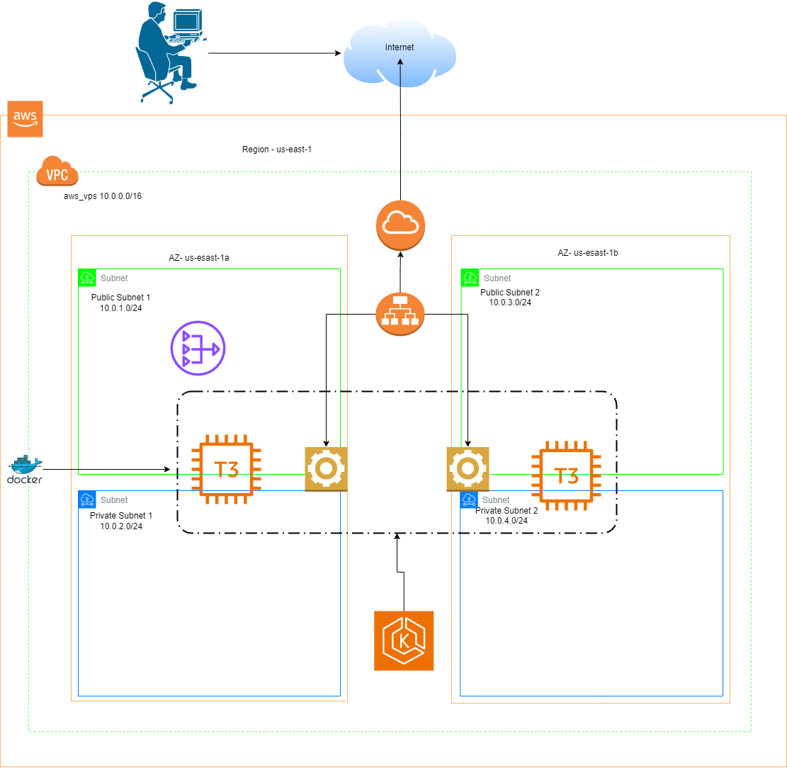
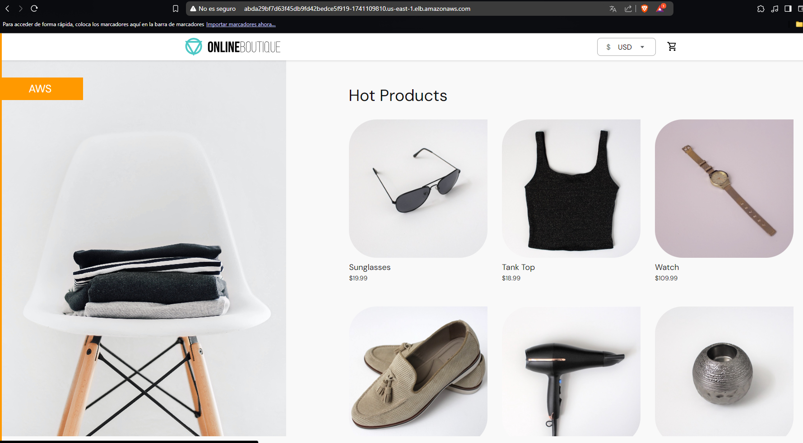
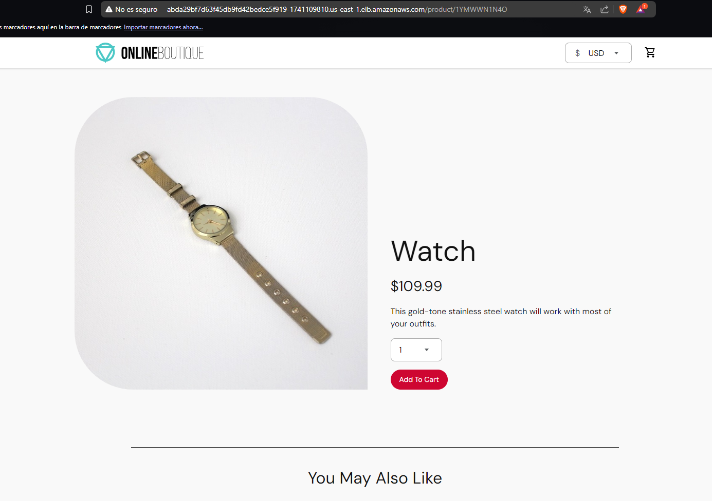
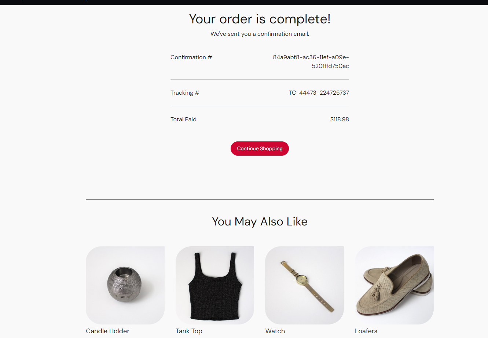
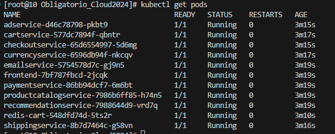

<h1 aling:"center"> Facultad de ingeniería | Escuela de tecnología | Analista en Infraestructura Informática</h1>

<p align="center">
  
</p>

<h2 align="center">Implementación de soluciones Cloud</h2>

Estimado visitante, sea bienvenidos al repositorio de GitHub del equipo Silva-Olveira.

En este respositorio se encuentra el proyecto realizado en el obligatorio de Soluciones en Implementaciones Cloud.

Nuestro repositorio es de contenido incremental, ya que a medida que se fue trabajando en el obligatorio, se fueron subiendo los cambios, trabajando con las mejores practicas.

## Descripción

Este proyecto esta diseñado en sistema operativo Linux CentOs, por lo que sugerimos correrlo en el mismo.En caso se no tenero correrlo en una maquina virtual.

Para poder ejecutar este proyecto, es fundamental tener instalados AWS CLI, Docker, Terraform y K8s. Las versiones requeridas de estas herramientas se especificarán más abajo, en caso de que desees instalarlas por tu cuenta.

## Requisitos del Sistema

- **Docker**
  - Versión: 27.3.1
  - Build: ce12230

- **Kubernetes**
  - Client Version: v1.31.3
  - Kustomize Version: v5.4.2

**Nota**: Se recomienda utilizar estas versiones específicas para garantizar la compatibilidad y el correcto funcionamiento del proyecto.

<strong>Microservicios a desplegar en Cloud</strong>

La aplicación Boutique esta compuesta por once microservicios que estan desarrollados en diferentes lenguajes.

<p align="center">
  
</p>

## Datos de infraestructura

<strong>Servicios de AWS utilizados</strong>
  - EC2
      - Tipo de instancias: t3.medium
  - EKS
  - VPC
  - Auto Scaling Groups
  - NAT Gateway
  - Internet Gatewat
  - Elastic Load Balanced
  - Secuity Groups
  - Docker

<strong>Bloques CIDRs</strong>

Para generar la VPC se utilizo el bloque 10.0.0.0/16. Luego dicho bloque fue separado en las siguientes subredes. También se utilizo la región "us-east-1", con dos zonas de disponibilidad "us-east-1a" y "us-east-1b".
  - Subnet Privada 1 - 10.0.2.0/24
  - Subnet Privada 2 - 10.0.4.0/24
  - Subnet Publica 1 - 10.0.1.0/24
  - Subnet Publica 2 - 10.0.3.0/24

## Diagrama
  

# Deployment  

Este documento describe los pasos necesarios para desplegar la aplicación correctamente.  

---

## **Requisitos previos**  
Asegúrate de tener instalados los siguientes servicios:  
- **Docker**  
- **Kubernetes**  
- **Terraform**  
- **AWS CLI**  


## Instalación de Servicios

Si alguno de los siguientes servicios no está instalado, puedes ejecutar el script [`installservices.sh`](./installservices.sh). Este script verificará la instalación de los servicios necesarios y procederá a instalarlos automáticamente en caso de que falten.

### Pasos para ejecutar el script:

1. **Asegúrate de estar en la carpeta del proyecto** (`Obligatorio_Cloud2024`).

2. **Dale permisos de ejecución al script** utilizando el siguiente comando:

    ```bash
    chmod a+x installservices.sh
    ```

3. **Ejecuta el script** con el siguiente comando:

    ```bash
    ./installservices.sh
    ```

Este proceso se asegurará de que los servicios necesarios estén instalados en tu máquina para que puedas continuar con el despliegue del proyecto.

---

## **Configuración de Docker Hub**  

1. Crea una cuenta en [Docker Hub](https://hub.docker.com/).
2. Asegúrate de tener tus credenciales de inicio de sesión listas para el siguiente paso.

---

## **Creación y subida de la imagen Docker**  

Ejecuta el script [`autoDocker.sh`](./autoDocker.sh), el cual se encargará de:  
1. Iniciar sesión en Docker Hub.  
2. Construir la imagen Docker basada en el Dockerfile de tu proyecto.  
3. Subir la imagen al repositorio de tu cuenta en Docker Hub.  

### Pasos para ejecutar el script:

1. **Asegúrate de estar en la carpeta del proyecto** (`Obligatorio_Cloud2024`).
2. **Dale permisos de ejecución al script** utilizando el siguiente comando:

    ```bash
    chmod a+x autoDocker.sh
    ```

3. **Ejecuta el script** con el siguiente comando:

    ```bash
    ./autoDocker.sh
    ```

Este proceso se encargará de iniciar sesión en Docker Hub, construir la imagen Docker de tu proyecto y subirla a tu cuenta en Docker Hub.

**Notas adicionales**  
Las imagenes pueden sacarse del directorio "src" dentro del directorio "`Obligatorio_Cloud2024`" y debera pasar la ruta absoluta cuando el script lo pida


---

## **Despliegue de la infraestructura y servicios**  

Para desplegar la infraestructura en AWS y los servicios en Kubernetes, ejecuta el script [`terraform.sh`](./terraform.sh). Este script realiza las siguientes tareas:  
- Configura Terraform para gestionar la infraestructura.  
- Crea los recursos necesarios en AWS, incluido un clúster y nodos EKS.  
- Despliega los servicios en el clúster Kubernetes utilizando los manifiestos definidos en el proyecto.

### Pasos para ejecutar el script:

1. **Asegúrate de estar en la carpeta del proyecto** (`Obligatorio_Cloud2024`).
2. **Dale permisos de ejecución al script** utilizando el siguiente comando:

    ```bash
    chmod a+x terraform.sh
    ```

3. **Ejecuta el script** con el siguiente comando:

    ```bash
    ./terraform.sh
    ```

Este proceso se encargará de configurar Terraform, crear los recursos en AWS y desplegar los servicios en Kubernetes según los manifiestos del proyecto.

## **Visualización de la aplicación**
Una vez que hayas ejecutado el script [`terraform.sh`](./terraform.sh), este te proporcionará la URL de la aplicación desplegada en AWS.

1. El script te mostrará la URL de la aplicación en la salida de la terminal, similar a la siguiente:

    ```
    La url para la pagina es: a60b1296f524e474abbd63ff0418d776-1835317911.us-east-1.elb.amazonaws.com
    ```
    3. Accede a la URL proporcionada para ingresar a la web. La interfaz de la aplicación debería verse de la siguiente manera:

   <p align="center">
   
   </p>

    <p align="center">
   
   </p>


   <p align="center">
   
   </p>
### Ten en cuenta lo siguiente:
- La aplicación puede demorar en cargar, ya que algunos pods tardan en quedar activos.
- Podrás verificar el estado de los pods con el siguiente comando:

  ```bash
  kubectl get pods
  ```
   <p align="center">
   
   </p>


---
## **Eliminación de la infraestructura y servicios**  

Para eliminar la infraestructura en AWS y los servicios en Kubernetes, ejecuta el script [`infradelete.sh`](./infradelete.sh). Este script realiza las siguientes tareas:  
- Elimina los recursos creados en AWS, incluidos el clúster y los nodos EKS.  
- Despliega la eliminación de los servicios en el clúster Kubernetes.

### Pasos para ejecutar el script:

1. **Asegúrate de estar en la carpeta del proyecto** (`Obligatorio_Cloud2024`).
2. **Dale permisos de ejecución al script** utilizando el siguiente comando:

    ```bash
    chmod a+x infradelete.sh
    ```

3. **Ejecuta el script** con el siguiente comando:

    ```bash
    ./infradelete.sh
    ```

Este proceso se encargará de eliminar la infraestructura y los servicios desplegados en AWS y Kubernetes según lo especificado en el proyecto.
### Alternativa usando Terraform:

Si prefieres no usar el script, puedes simplemente hacer un `cd` al directorio donde se encuentra el archivo de Terraform y ejecutar el siguiente comando para destruir la infraestructura:

```bash
cd terraform
terraform apply --destroy
 ```

## **Notas adicionales**  
- Asegúrate de revisar los archivos de configuración antes de ejecutar los scripts para adaptarlos a tus necesidades.  
 
---

¡Con estos pasos, tendrás tu aplicación lista y funcionando correctamente! 🎉 

---

## **Mejoras a Futuro**

A continuación, se presentan algunas ideas y mejoras que podrían implementarse en el futuro para optimizar y mejorar la aplicación:

1. Dar una mejor solucion al problema al ejecutar "terrafom apply", es decir no ejecutarlo 2 veces para que levanten los pods.
 

## Equipo de alumnos

El grupo de alumnos del oligatorio son los siguientes

</p>
<p align = "center"><strong>Valeria Silva</strong></p>
<p align = "center"><strong>VS267838@fi365.ort.edu.uy</strong></p>
<p align = "center"><strong>Número de estudiante - 267838</strong></p>

</p>
<p align = "center"><strong>Facundo Olveira</strong></p>
<p align = "center"><strong>FO275181@fi365.ort.edu.uy</strong></p>
<p align = "center"><strong>Número de estudiante - 275181</strong></p>


<p align="center">
  <strong>Docente:</strong> Mauricio Amendola
</p>

## Bibliografía

- [Aulas](https://aulas.ort.edu.uy/)
- [AWS](https://docs.aws.amazon.com/)
- [Docker](https://www.docker.com/)
- [Kubernetes](https://kubernetes.io/es/)
- [Terraform](https://www.terraform.io/)
- [ChatGPT](https://chat.openai.com/)