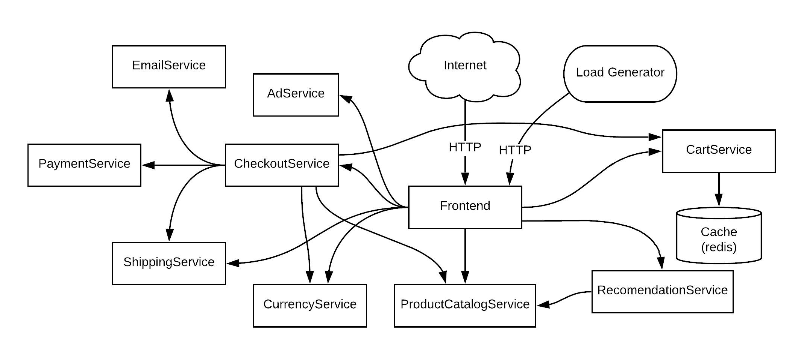

<h1 aling:"center"> Facultad de ingeniería | Escuela de tecnología | Analista en Infraestructura Informática</h1>

  

<h2 align="center">Implementación de soluciones Cloud</h2>

Estimado visitante, sea bienvenidos al repositorio de GitHub del equipo Silva-Olveira.

En este respositorio se encuentra el proyecto realizado en el obligatorio de Soluciones en Implementaciones Cloud.

Nuestro repositorio es de contenido incremental, ya que a medida que se fue trabajando en el obligatorio, se fueron subiendo los cambios, trabajando con las mejores practicas.

## Descripción

Este proyecto esta diseñado en sistema operativo Linux CentOs, por lo que sugerimos correrlo en el mismo.En caso se no tenero correrlo en una maquina virtual.

Para poder correr este proyecto es fundamenteal tener instalado AWS CLI, DOCKER, TERRAFOR y AWS EKS CLI, las versiones requeridas para esto mismo, se especificara más abajo.

## Requisitos del Sistema

- **Docker**
  - Versión: 27.3.1
  - Build: ce12230

- **Kubernetes**
  - Client Version: v1.31.3
  - Kustomize Version: v5.4.2

**Nota**: Se recomienda utilizar estas versiones específicas para garantizar la compatibilidad y el correcto funcionamiento del proyecto.

<strong>Microservicios a desplegar en Cloud</strong>

La aplicación Boutique esta compuesta por once microservicios que estan desarrollados en diferentes lenguajes.

  

## Datos de infraestructura

<strong>Servicios de AWS utilizados</strong>
  - EC2
      - Tipo de instancias: t3.medium
  - EKS
  - VPC
  - Auto Scaling Groups
  - NAT Gateway
  - Internet Gatewat
  - Elastic Load Balanced

<strong>Bloques CIDRs</strong>

Para generar la VPC se utilizo el bloque 10.0.0.0/16. Luego dicho bloque fue separado en las siguientes subredes. También se utilizo la región "us-east-1", con dos zonas de disponibilidad "us-east-1a" y "us-east-1b".
  - Subnet Privada 1 - 10.0.2.0/24
  - Subnet Privada 2 - 10.0.4.0/24
  - Subnet Publica 1 - 10.0.1.0/24
  - Subnet Publica 2 - 10.0.3.0/24

## Diagrama
  

## Equipo de alumnos

El grupo de alumnos del oligatorio son los siguientes

<strong>Valeria Silva</strong>

<strong>VS267838@fi365.ort.edu.uy</strong>

<strong>Número de estudiante - 267838</strong>

<strong>Facundo Olveira</strong>

<strong>FO275181@fi365.ort.edu.uy</strong>

<strong>Número de estudiante - 275181</strong>

  <strong>Docente:</strong> Mauricio Amendola

## Bibliografía

- [Aulas](https://aulas.ort.edu.uy/)
- [AWS](https://docs.aws.amazon.com/)
- [Docker](https://www.docker.com/)
- [Kubernetes](https://kubernetes.io/es/)
- [Terraform](https://www.terraform.io/)